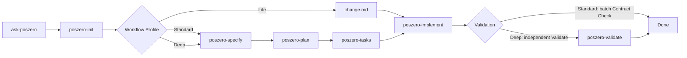

# PosZero

SDD skills for agent-assisted software development.

[`LLM guide`](llms.txt)

## Skills

Each PosZero skill is invoked by the user. `ask-poszero` diagnoses the current state and recommends the next skill; it does not invoke another skill.

Skill | When | What it does
--- | --- | ---
`poszero-init` | Starting SDD in a repository | Initializes or checks `.sdd/` infrastructure and the Constitution.
`poszero-specify` | Before planning implementation | Turns a problem into an approvable `spec.md`.
`poszero-plan` | After a Spec is approved | Turns the approved Spec into `plan.md`.
`poszero-tasks` | Before implementation starts | Breaks the approved Plan into verifiable `tasks.md`.
`poszero-implement` | Working one ready task | Implements one Ready `TASK-*` and records Evidence.
`poszero-validate` | Before accepting the result | Independently validates the approved Contract.
`ask-poszero` | Unsure what to do next | Explains the workflow or reads SDD state and recommends the next user-invoked skill.

## Recommended Flow



`ask-poszero` is informational and does not invoke another Skill. Lite may skip Spec, Plan, and Tasks when existing execution input is sufficient.

## Project Output

PosZero writes project state to `.sdd/` in the target project. Init asks once for Chinese or English document templates and records the choice in `.sdd/README.md`; later stages reuse it unless explicitly changed. Task-related checks gate local completion/commits; independent required project checks gate final validation.

```text
.sdd/
├── README.md
├── constitution.md
├── templates/
└── <feature-slug>/
    ├── change.md   # Lite workflow only
    ├── spec.md     # Standard / Deep workflow
    ├── plan.md     # Standard / Deep workflow
    ├── tasks.md
    └── validation.md
```

## Install

This repository is the PosZero source package. For local development, install dependencies and run the verifier:

```bash
npm install
npm run verify
```

The package exposes skills from `./skills` for Pi-compatible skill installers.

## Runtime Surface

Agent installers should install `skills/` as the runtime surface. Each skill directory owns the files it needs at runtime, including `SKILL.md`, `references/`, and any skill-local assets.

Root-level `protocol/`, `rules/`, `scripts/`, `package.json`, and release files are repository infrastructure for development, verification, packaging, and platform adaptation. They are part of the source package, but are not the default Agent runtime install surface.

## Repository Layout

Path | Purpose
--- | ---
`VERSION` | PosZero suite version.
`TEMPLATE_VERSION` | `.sdd/templates/` contract version.
`protocol/` | Maintained shared protocol source.
`skills/` | Maintained skill source.
`skills/poszero-init/references/templates/` | Maintained `.sdd/` bootstrap template source.
`rules/` | Suite-level agent rules.
`scripts/` | Repository development tools.
`packaging.allowlist` | Default-deny distribution boundary.

`poszero/skills/` is the source of truth. The outer `../skills/poszero-*` and `../skills/ask-poszero` directories are distribution mirrors used by `ai-config`.

## Release

Create a version tag that matches `VERSION` and push it:

```bash
git tag v$(cat VERSION)
git push origin v$(cat VERSION)
```

The release workflow verifies metadata, runs `npm run verify`, packs the npm tarball, creates the GitHub Release, and uploads the tarball as a release asset.

## Why

PosZero keeps SDD work explicit. Specs, plans, tasks, and validation evidence live as Markdown contracts in the target repository, so agents can continue from durable project state instead of conversation memory.

The suite is intentionally user-invoked: each skill has one job, clear inputs, and a concrete file outcome. `ask-poszero` routes the next step without silently chaining into another workflow.

## License

MIT License.
